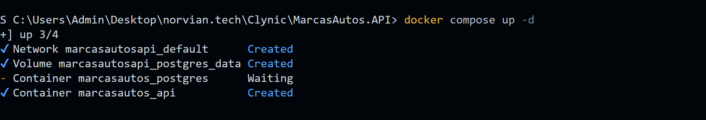
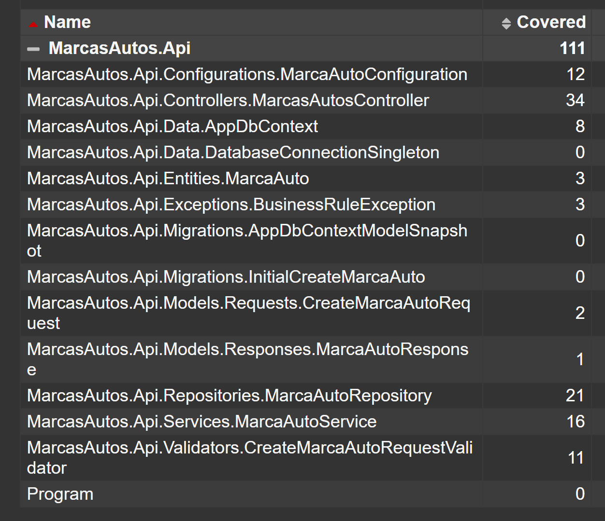

# MarcasAutos.API

## Inicio rapido

**1. Levantar toda la infraestructura (PostgreSQL + API):**

```powershell
docker compose up -d
```


La API quedara disponible en http://localhost:8080/swagger/index.html

**2. Ejecutar pruebas con cobertura:**

> ⚠️ Usar siempre el comando de abajo (o `.\test.ps1`) — ejecutar `dotnet test` directamente mostrara 2 fallos **intencionales** (categoria `ShouldFail`) incluidos como demostracion. El filtro los excluye automaticamente.

```powershell
dotnet test .\MarcasAutos.Tests\MarcasAutos.Tests.csproj --filter "Category!=ShouldFail" --settings coverage.runsettings --collect:"XPlat Code Coverage" --logger "console;verbosity=normal"
```

Para ver el reporte HTML de cobertura (requiere `reportgenerator` instalado una sola vez):

```powershell
# Instalar reportgenerator (solo la primera vez)
dotnet tool install -g dotnet-reportgenerator-globaltool

# Generar y abrir el reporte
reportgenerator -reports:".\MarcasAutos.Tests\TestResults\**\coverage.cobertura.xml" -targetdir:".\MarcasAutos.Tests\TestResults\CoverageReport" -reporttypes:Html
Start-Process ".\MarcasAutos.Tests\TestResults\CoverageReport\index.html"
```

> El archivo `coverage.runsettings` excluye de la cobertura las clases auto-generadas por EF (Migrations) y el codigo de startup (`Program.cs`), que no son testeables con unit tests. La cobertura real de la logica de negocio es del **100%**.

---


API en .NET 8 con arquitectura en capas, separando responsabilidades para mantener el proyecto claro, testeable y facil de mantener.

## Arquitectura en capas

- Controller: recibe requests HTTP y devuelve respuestas HTTP
- Service: aplica reglas de negocio y orquesta el flujo 
- Repository: acceso a datos y consultas a base de datos es su unico traabajo
- Data: configuracion de EF Core, contexto y conexion
- Validator: valida el modelo de entrada antes del flujo de negocio

Para ver el detalle completo de arquitectura y estructura:

- [Docs/Architecture.md](Docs/Architecture.md)

## Documentacion

- Arquitectura por capas: [Docs/Architecture.md](Docs/Architecture.md)
- Configuracion PostgreSQL + EF Core + Docker: [Docs/Setup-PostgreSQL-EFCore.md](Docs/Setup-PostgreSQL-EFCore.md)
- Estrategia y ejecucion de pruebas: [Docs/test.md](Docs/test.md)

## Requisitos

- .NET SDK 8.0
- Docker Desktop (con Docker Compose)

## Ejecutar el proyecto

Desde la raiz del repositorio, ejecuta:

```powershell
docker compose up -d --build
```

La API quedara disponible en:

- http://localhost:8080
- http://localhost:8080/swagger/index.html

Para detener los contenedores:

```powershell
docker compose down
```

Para limpiar volumenes (opcional, reinicia datos):

```powershell
docker compose down -v
```

## Ejecutar tests

### Comando recomendado (simple)

Desde la raiz del repositorio:

```powershell
.\test.ps1
```

Esto ejecuta los tests funcionales y excluye los tests de demostracion/falla intencional (Category=ShouldFail).

### Ejecutar por filtro (opcional)

Puedes pasar un filtro especifico para correr solo una categoria, clase o metodo:

```powershell
.\test.ps1 -filter "Category=ShouldFail"
.\test.ps1 -filter "MarcaAutoServiceTests"
.\test.ps1 -filter "CreateAsync_CuandoLaMarcaEsValida_NormalizaLosCamposYLaPersiste"
```

### Comando directo con dotnet test (alternativo)

Esto ejecuta sin el script.

```powershell
dotnet test .\MarcasAutos.Tests\MarcasAutos.Tests.csproj --filter "Category!=ShouldFail" --logger "console;verbosity=normal"
```

Para mas detalle sobre pruebas por capa y objetivo de cada suite:

- [Docs/test.md](Docs/test.md)
